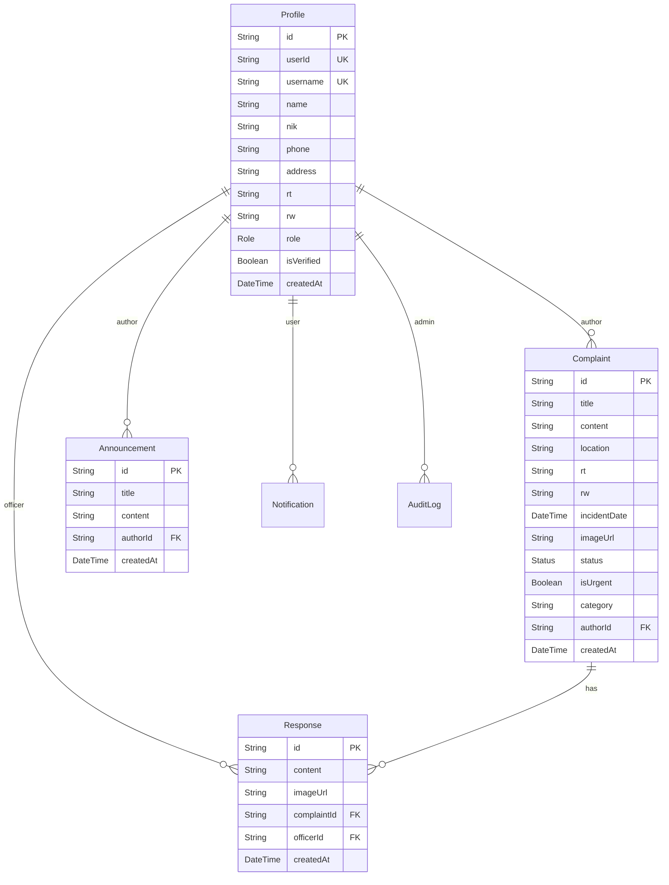

# ⚡ SmartComplaint — Pesona Serpong Residential Ecosystem

[](https://nextjs.org)
[](https://react.dev)
[](https://tailwindcss.com)
[](https://prisma.io)
[](https://supabase.com)
[](#license)

A high-end, responsive, and secure residential community complaint management platform designed for the **Pesona Serpong** housing complex. Inspired by the sleek, typography-heavy **Wise (TransferWise) design philosophy**, it features a warm, sage-canvas light mode, premium dark mode, secure Role-Based Access Control (RBAC), robust Server Action-driven workflows, and real-time community announcements.

---

## 📖 Short Description
**SmartComplaint** bridges the communication gap between citizens, neighborhood officers, and administrators. It empowers residents to file geo-localized complaints with real-time photo uploads, tracks reports through an interactive visual lifecycle (Pending ➜ Processing ➜ Completed), and hosts administrative announcement broadcasts to foster a transparent, cooperative, and safe neighborhood environment.

---

## 💡 The Problem it Solves
Traditional residential management often suffers from fragmented and archaic communication channels:
1. **Scattered & Unstructured Chats**: Complaints sent in WhatsApp groups are quickly buried under standard banter, leading to overlooked issues and forgotten infrastructure work.
2. **Lack of Transparency**: Residents file complaints but have no visibility into whether their concerns are received, actively worked on, or resolved.
3. **No Centralized History**: Neighborhood associations (RT/RW) lack comprehensive logs or audit trails of historical issues to guide budgeting and town hall decisions.
4. **Coordination Overhead**: Manually sorting reports by category (e.g., Security, Cleanliness, Infrastructure) and prioritization (Urgent vs. Standard) is tedious and error-prone.

**SmartComplaint solves this by providing a unified, real-time command center** where every report is categorized, assigned an urgency flag, tracked with visual timeline updates, and accompanied by transparent, official response threads.

---

## ✨ Main Features

### 🏡 1. Full-Fidelity Citizen Reports
* **Categorized Filing**: Submit issues under dedicated domains (e.g., Infrastructure, Security, Waste Management, General).
* **Geo-Location Details**: Specify exact RT/RW coordinates, block, and house numbers for pinpoint repair routing.
* **Photo Attachments**: Directly upload images demonstrating issues (e.g., street light outages, garbage piles) backed securely by **Supabase Storage**.
* **Urgency Toggle**: Flag critical incidents (e.g., security breaches) to draw immediate attention.

### 🔄 2. Dynamic Status Lifecycles & Responses
* **Status Pipeline**: Watch tickets move dynamically across `PENDING`, `PROCESSING`, and `COMPLETED` phases.
* **Interactive Officer Thread**: Officers can post official updates, attach completion images, and adjust statuses in real-time.
* **Revision Flow**: Residents retain full control to edit or withdraw their reports as needed.

### 📣 3. Board Announcements & Alerts
* **Official Bulletins**: Admins can publish, update, or pin community announcements directly onto the user dashboard.
* **Notification Stream**: Users receive immediate in-app notifications if an administrator takes actions on their report or releases new notices.

### 🔑 4. Strict Role-Based Security (RBAC)
Three distinct, non-overlapping user segments govern the application:
* **Masyarakat (Citizen)**: File, edit, and track personal complaints, read announcements, and manage profiles.
* **Petugas (Officer)**: Review all neighborhood complaints, submit official response updates with images, and transition ticket statuses.
* **Admin (Administrator)**: Full supervisory control — verify newly registered residents, promote users to officers, audit/delete content, and publish global announcements.

### 📊 5. Statistical Dashboard Widgets
* Fully functional analytics widgets displaying critical KPIs: **Total Reports**, **Tuntas Ditangani (95% Resolution Rate)**, **Average Response Time (12h)**, and **Active Blocks**.

### 🎨 6. Premium Wise-Inspired Aesthetic
* **Palette**: Tailored HSL colors, featuring the signature vivid lime-green CTA pill (`#9fe870`), pale sage-tinted background canvas (`#e8ebe6`), and deep olive-warm ink (`#0e0f0c`).
* **Micro-Animations**: Smooth scale transforms, page transitions, and loading states for a highly premium, fluid interface.
* **Responsive Touch-Targets**: Fully optimized for mobile screens, tablets, and desktops using WCAG AAA standards.

---

## 🛠️ Tech Stack & Rationales

| Technology | Role | Rationale |
|:---|:---|:---|
| **Next.js 16 (App Router)** | Framework | Provides optimized Server-Side Rendering (SSR), stable Server Actions, layout persistence, and lightning-fast page loading times. |
| **React 19** | Frontend Engine | Utilizes standard high-performance concurrent rendering features and native form-handling states. |
| **Tailwind CSS v4** | UI Styling | Standard-setting utility library, enabling rapid execution of the customized Wise design tokens and responsive layout structure. |
| **Supabase Client & Auth** | Security / Storage | Provides industry-grade authentication, secure session handling, JWT parsing, and scalable, encrypted binary storage buckets. |
| **Prisma ORM** | Data Mapping | Direct type-safe Prisma Client, abstracting raw SQL queries and facilitating robust, clean database schema migrations. |
| **PostgreSQL** | Database | High-performance relational database hosted on Supabase, guaranteeing transactions, consistency, and efficient index lookups. |
| **Lucide React** | Iconography | Crisp, lightweight, and modern vector icon pack supporting high visual accessibility. |

---

## 🗃️ Database Schema

The system uses a beautifully structured, highly indexed relational schema managed by Prisma:



---

## 🚀 Installation & Quick Start

Follow these steps to get a local development instance of **SmartComplaint** up and running.

### 📋 Prerequisites
* **Node.js** (v18+ recommended)
* **npm** or **yarn**
* A running **PostgreSQL** database (e.g., via Supabase or local PostgreSQL)
* A **Supabase** project for Auth and Storage (with a bucket named `complaints` set to public access).

### 🛠️ Step-by-Step Setup

1. **Clone the Repository**
   ```bash
   git clone https://github.com/WahyutegarNugroho/smart-complaint.git
   cd smart-complaint
   ```

2. **Install Dependencies**
   ```bash
   npm install
   ```

3. **Configure Environment Variables**
   Create a `.env` file in the root directory and configure the following variables:
   ```env
   # PostgreSQL Connection URLs (Supabase Pooling / Direct)
   DATABASE_URL="postgresql://<username>:<password>@<host>:<port>/<db_name>?pgbouncer=true"
   DIRECT_URL="postgresql://<username>:<password>@<host>:<port>/<db_name>"

   # Supabase Keys
   NEXT_PUBLIC_SUPABASE_URL="https://your-supabase-project.supabase.co"
   NEXT_PUBLIC_SUPABASE_ANON_KEY="your-anon-key-here"
   ```

4. **Initialize the Database**
   Push the schema to your database and generate the client:
   ```bash
   npx prisma db push
   npx prisma generate
   ```

5. **Run the Development Server**
   ```bash
   npm run dev
   ```
   Open [http://localhost:3000](http://localhost:3000) with your browser to experience the platform!

---

## 📝 License
This project is licensed under the [MIT License](LICENSE) — feel free to customize and redistribute as desired.

---

*Designed and developed with ⚡ for the harmony of **Pesona Serpong** residents.*
